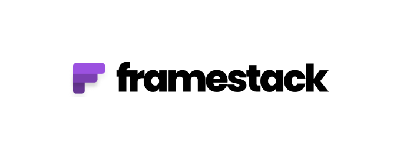

 
  

  
 
 
 

## What is Framestack ? 

Framestack is an open library of tools/frameworks/libraries you can use to create and build your next project ! [About Page](https://framestack.net/about)

## Community

The Framestack community can be found on [GitHub Discussions](https://github.com/swve/framestack/discussions), where you can ask questions, voice ideas, and share your projects.

Our [Code of Conduct](https://github.com/vercel/next.js/blob/canary/CODE_OF_CONDUCT.md) applies to all Next.js community channels.

## Contributing

Please see our [contributing.md](/contributing.md).

## Authors

Badr B. ([@swve](https://github.com/swve))
